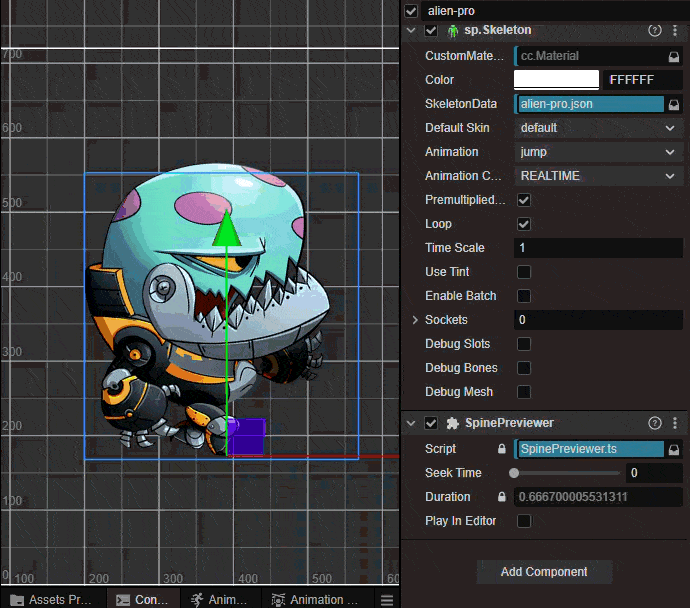
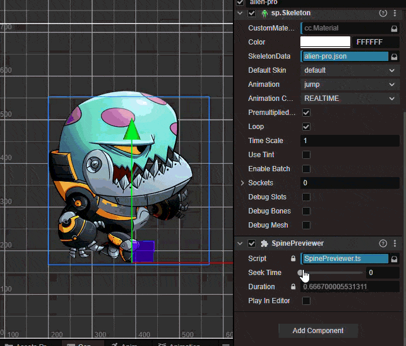

# Spine Animation Scene Previewer

A single component designed to preview Spine Animations directly within the Editor environment without the need for Runtime execution.

Support: 
Cocos Creator version 3.8.3
---

## How to Use

To use this component, simply follow these steps:

* **Step 1:** Drag this component into a **Node** that contains an `sp.Skeleton` component.
* **Step 2:** In the Inspector panel, toggle the **Play In Editor** checkbox.
* **Step 3:** Observe the animation playing directly on the Editor screen.

## Seeking Time

Use the horizontal slider to seek to a specific frame.

---

## Benefits
* Optimizes your workflow by allowing for faster adjustment of positioning and motion.
